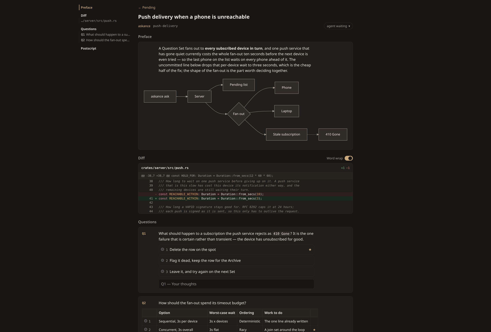

# Askance

Askance is a simple and beautiful human-in-the-loop GUI for answering questions
from an AI coding agent such as Claude Code, either in the browser or on the go
with your phone.

It works by combining a server which you run locally with a self-documenting
command-line utility which your agent uses to put questions to you. The CLI
blocks on your answer so your agent waits for you, you answer whenever you're
ready.

#### Features

* 📊 See agent feedback in richly formatted Markdown with Mermaid diagrams.
* ✅ Answer questions with a single click, and attach free text to any answer.
* 📋 Decide on multi-factor tradeoffs by picking from a table.
* 🔍 View diffs of uncommitted code right next to agent feedback.
* 📱 Respond from your desktop or your phone.
* 🔔 Get notified when an agent is waiting on you with push notifications.

#### Screenshot



## Installation

### NixOS

Add the following to your nix flake to install fully on nix.

```nix
# Imports the latest version as a nix flake
inputs.askance = {
  url = "github:tobico/askance";
  inputs.nixpkgs.follows = "nixpkgs";
};

# The module comes from the input rather than from pkgs, so it has to be
# imported before it can be enabled. In your host's module list:
modules = [
  askance.nixosModules.askance
  { services.askance.enable = true; }
];
```

This runs the server daemon under its own user, and adds the Askance CLI to
every user's `PATH`.

### Other Linux, Mac, Windows

Askance is distributed as a single binary, which you download and run from your
home folder. It runs on Linux, Mac, and Windows via WSL.

```console
mkdir -p ~/.local/bin && curl -fsSL -o ~/.local/bin/askance \
  "https://github.com/tobico/askance/releases/latest/download/askance-$(uname -s | tr '[:upper:]' '[:lower:]' | sed s/darwin/macos/)-$(uname -m | sed -e s/x86_64/x64/ -e s/aarch64/arm64/)" \
  && chmod +x ~/.local/bin/askance
```

`~/.local/bin` needs to be on your `PATH`, which on most systems it already is.

You can run the server manually with `askance serve`; by default it will listen
on `127.0.0.1:8422`. Open <http://127.0.0.1:8422/> and you'll find the pending
list, which is where your agent's questions turn up.

#### Askance Server on Linux

Askance server works fine when run manually, but for convenience you can add a
systemd user unit to have it start automatically with your machine.

`~/.config/systemd/user/askance.service`:

```ini
[Unit]
Description=Askance — questions from coding agents to a human
After=network.target

[Service]
ExecStart=%h/.local/bin/askance serve --listen 127.0.0.1:8422 \
    --database %S/askance/askance.db
StateDirectory=askance
Restart=always
RestartSec=5s
NoNewPrivileges=true
RestrictSUIDSGID=true
UMask=0077

[Install]
WantedBy=default.target
```

Then start it:

```console
systemctl --user daemon-reload
systemctl --user enable --now askance
```

#### Askance Server on Mac

macOS doesn't have systemd; its equivalent is launchd.

Create a per-user agent, running as you, in
`~/Library/LaunchAgents/net.tobico.askance.plist`. launchd doesn't expand `~`,
so the paths are spelled out — replace `you` with your username:

```xml
<?xml version="1.0" encoding="UTF-8"?>
<!DOCTYPE plist PUBLIC "-//Apple//DTD PLIST 1.0//EN"
  "http://www.apple.com/DTDs/PropertyList-1.0.dtd">
<plist version="1.0">
<dict>
  <key>Label</key>
  <string>net.tobico.askance</string>
  <key>ProgramArguments</key>
  <array>
    <string>/Users/you/.local/bin/askance</string>
    <string>serve</string>
    <string>--listen</string>
    <string>127.0.0.1:8422</string>
    <string>--database</string>
    <string>/Users/you/Library/Application Support/askance/askance.db</string>
  </array>
  <!-- Start at login, and come back if it dies — an agent is blocked on an
       answer for as long as the server is down. -->
  <key>RunAtLoad</key>
  <true/>
  <key>KeepAlive</key>
  <true/>
</dict>
</plist>
```

```console
launchctl bootstrap gui/$(id -u) ~/Library/LaunchAgents/net.tobico.askance.plist
launchctl print gui/$(id -u)/net.tobico.askance
```

The database's parent directory is created for you, so there's nothing to set
up before the first start.

### Configuring your agent

Add the following to your `~/.claude/CLAUDE.md` file or equivalent:

> Never use the AskUserQuestion tool. Put all questions and approvals to me
> through askance: run `askance` once per session for the guide and follow it,
> including the topic guides it requires.

The `askance` CLI is self-documenting and will guide your agent with
built-in guides on how to use it effectively as needed.

## Skills

Askance is designed to be especially useful in two situations:

1. When your agent asks you a lot of questions
2. When your agent leaves code uncommitted as an acceptance gate, asking your
  permission before committing it.

In order to benefit from this, you need to actually have skills or prompts which
instruct your agent to do those things.

Two such skills are included as examples, but feel free to use whichever skills
or prompting approach you prefer; Askance will adapt to it.

**[Grilling](examples/skills/grilling.md)** — interviews you about a plan by
  asking a series of questions until a shared understanding is reached.
  Inspired by the [Matt Pocock grilling skill](https://github.com/mattpocock/skills)

**[Acceptance gate](examples/skills/acceptance-gate.md)** — puts a gate before
  committing code changes. The agent waits for your feedback and addresses it,
  only proceeding to commit the code with your express approval.

## Securing access

When running Askance, it's vital to understand the security implications. It
runs as a server on your machine, with no authentication system, and accepts
text input which is passed directly to your agent without sanitization.

What keeps it safe is making sure that your server is never made available to
others. By default it runs bound to 127.0.0.1, meaning it can't be accessed
from other machines.

If you do want to access it from another machine (your phone for example), the
recommended approach is to proxy that connection through `tailscale serve`,
which lets you use Tailscale's authentication to control access, and adds TLS
encryption provided by Tailscale (which is itself a requirement if you want to
enable push notifications).

With Tailscale installed, run the following to set up a Tailscale proxy to your
Askance server. The `--bg` option makes it persistent across reboots.

```console
tailscale serve --bg 8422
```

**Note:** To receive notifications on iOS, you'll need to add the site to
your home screen. On Mobile Safari, tap "...", "Share", "View More", then
"Add to Home Screen".

## Updating

To check the current version, run `askance --version`.

**Installed with curl:** run the install command again, which overwrites the
binary in place, then restart the server — `systemctl --user restart askance`
on Linux, or `launchctl kickstart -k gui/$(id -u)/net.tobico.askance` on a Mac.

**Installed from the flake:** Run `nix flake update askance` in your host
configuration, then rebuild — the rebuild restarts the service for you.

The database is untouched either way, so the Archive and your phone's push
subscription come back with the new binary. The server also asks GitHub once a
day whether a newer release exists, and puts a banner above the pending list
when there is one; it never installs anything itself, and
`ASKANCE_NO_UPDATE_CHECK` turns the check off.

## Configuration

Askance can be configured by environment variables or CLI options:

| Variable | CLI Option | Used by | Default | What it is |
| --- | --- | --- | --- | --- |
| `ASKANCE_SERVER` | `--server` | CLI | `http://127.0.0.1:8422` | Base URL the CLI submits to and waits on. |
| `ASKANCE_LISTEN` | `--listen` | server | `127.0.0.1:8422` | Address and port to bind. |
| `ASKANCE_DATABASE` | `--database` | server | `askance.db` | SQLite database for Askance data. |
| `ASKANCE_NO_UPDATE_CHECK` | `--no-update-check` | server | unset | Disables the automated daily check to GitHub to notify you of a new Askance release. |

## Other documentation

**[Deployment](docs/deployment.md)** — running the server as a service, in
full: the NixOS module this flake carries, and a systemd unit for a host that
isn't NixOS.

**[On your phone](docs/phone.md)** — `tailscale serve`, adding the site to your
home screen, turning notifications on per device, and how the long waits behave
through the proxy.

**[Development](docs/development.md)** — the dev shell, building the viewer,
and the loop for working on Askance itself.

**[Releasing](docs/releasing.md)** — how a tag becomes the binaries the install
command above fetches.

**[CONTEXT.md](CONTEXT.md)** — the project's vocabulary. Question Set, Preface,
Answer, Response and the rest, defined once.

## License

MIT — see [LICENSE](LICENSE).
