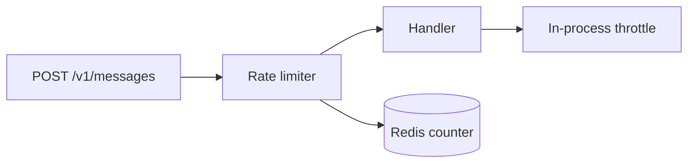

# Confirmation gates

A gate is a Set waiting on a yes — approval to commit, to land, to ship. Put
these to the human, and preferentially: finished work sitting unlanded until
a human says so is what askance exists for.

A gate is a degenerate Set: one Question, proceed or don't. The `preface`
does the work — what was built, and what happens on a yes — because the human
decides without seeing the session. The attached diff is the rest of the
evidence.

**Include a structure diagram unless the change is trivial** — a few files,
no new relationships. The diff shows every changed line and nothing about the
shape they add up to, and the shape is what the gate asks the human to
approve.

- Diagram the delta, not the system: only the components the change touches,
  each tagged `new`, `modified` or `removed`. The viewer colours the tags to
  match the diff.
- A before/after pair only when existing structure is reshaped. Pure
  additions need one diagram with the new parts tagged.
- A sequence diagram when the point is a new runtime flow rather than a new
  arrangement of parts.

A gate's Response is read strictly:

- A selected proceed Option is approval.
- `unanswered: true` is not approval — the human declined to decide, and the
  gate stays shut.
- A `comment` or `free_text` that asks something back is a counter-question:
  answer it, then put the same gate again.
- Anything ambiguous stays shut.

**Fail closed.** A gate that fails closed costs a round trip; one that fails
open ships work nobody approved.
